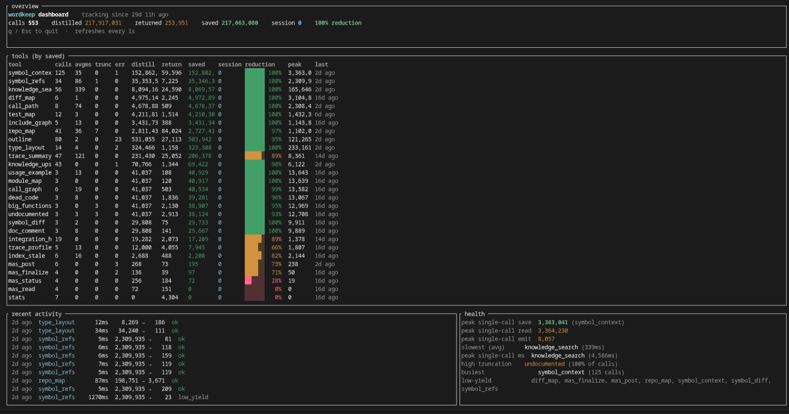
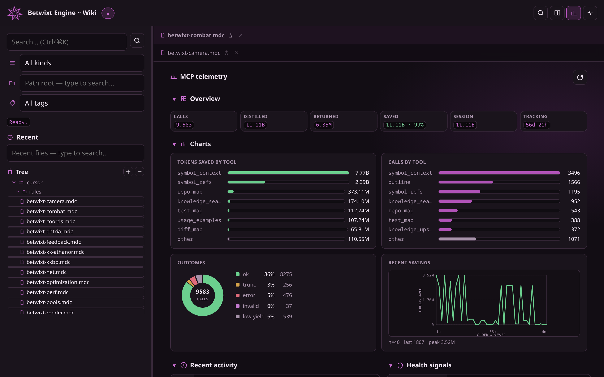
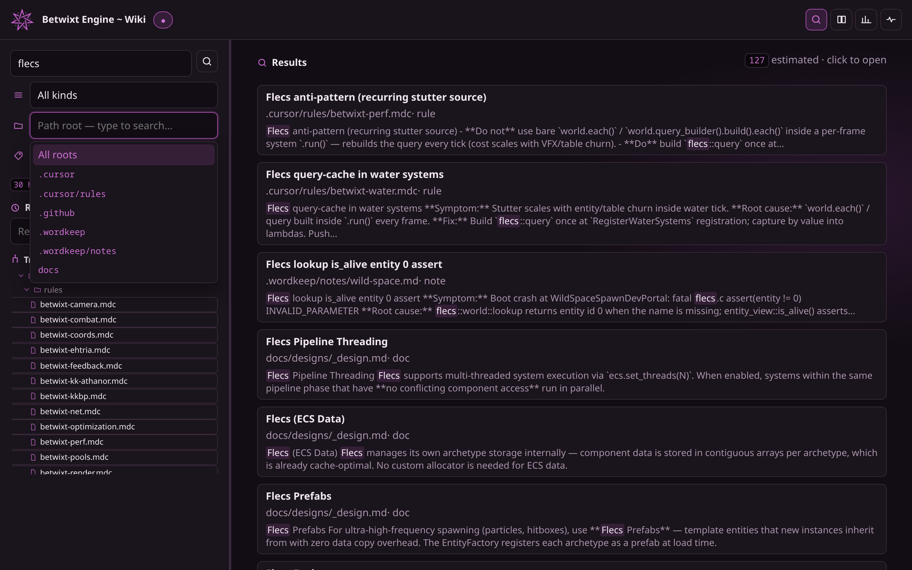
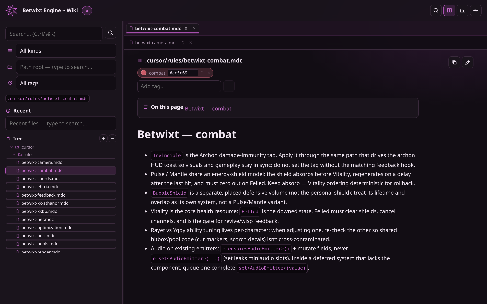
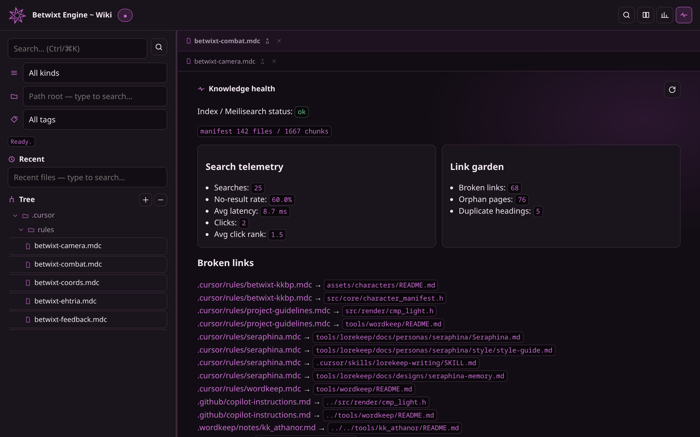

# wordkeep

Local MCP server that gives coding agents structured, token-budgeted context
instead of full-file dumps. Point it at any repository with `--root` and call
tools over stdio (JSON-RPC).

Works with Cursor, VS Code Copilot, Claude Desktop, Zed, and other MCP clients.

See [blog.md](./blog.md) for project rationale, architecture decisions, and the problems solved during development.



*Terminal dashboard (`cargo run --features dashboard -- dashboard`) — per-tool token
displacement, recent activity, and health signals. Large counts abbreviate as
`3.25M` / `1.23B` / `3.25T` once they pass a million.*

## Wiki companion

`wordkeep-wiki` is an optional local browser UI over the same Markdown knowledge
(Meilisearch + dark Svelte app). Same telemetry as the terminal dashboard, plus
search, reader tabs, and garden health.



*GUI dashboard tab — live `/api/dashboard` poll of the same `savings.json` as the
terminal TUI (no `dashboard` Cargo feature required). Includes live bar / donut /
line charts (axes + hover metrics) and collapsible sections (open/closed state
persisted).*)



*Instant search with kind / path-root / tag typeaheads and highlighted snippets.*



*Reader with VS Code-style pinned tabs, frontmatter tag CRUD, and per-tag colors
(picker + copyable hex).*



*Knowledge health — Meilisearch/manifest status, search telemetry, and link-garden
scan (broken / orphan / duplicate headings). Sections collapse like the Dashboard.*)

```sh
docker compose -f docker-compose.wiki.yml up -d
cargo run -p wordkeep-wiki -- --root /path/to/repo index --full
cargo run -p wordkeep-wiki -- --root /path/to/repo serve --watch
# UI: http://127.0.0.1:8787
```

Optional idempotent launcher (same binary search as `mcp.sh`): [wiki.sh](wiki.sh) brings up Meilisearch + `serve --watch --runtime-attach` if `:8787` is not already healthy. In the Betwixt monorepo, Cursor runs it on folder open via `.vscode/tasks.json`. Health → Runtime needs that attach flag plus a current `wiki/dist` build.

```sh
./wiki.sh
# UI: http://127.0.0.1:8787
```

Optional Linux allocation attach (requires `bpftrace`; elevation depends on
Yama/eBPF policy). The helper is separate so the wiki process never elevates:

```sh
cargo build -p wordkeep-wiki --bin wordkeep-runtime-helper
export WORDKEEP_RUNTIME_TOKEN="$(curl -s http://127.0.0.1:8787/api/runtime | jq -r .token)"
./target/debug/wordkeep-runtime-helper --pid <PID>
# If policy requires it:
sudo --preserve-env=WORDKEEP_RUNTIME_TOKEN ./target/debug/wordkeep-runtime-helper --pid <PID>
```

The stream covers allocations after attach and is labeled sampled. Use
`--backend perf` for Linux data-address samples, `--backend etw` for a Windows
heap + SampledProfile session (elevation required), or `--input` to replay a
tracerpt/perf text dump. Cooperative Jolt/Flecs diagnostics work without the
helper.

Refresh README screenshots (wiki must be serving on `:8787`):

```sh
cd wiki && bun run shots
```

## Install

### Prebuilt binary (recommended)

Download the archive for your platform from
[GitHub Releases](https://github.com/inatos/wordkeep/releases). Verify the
checksum in `SHA256SUMS.txt`, unpack, and put `wordkeep` on your `PATH`.

### Build from source

```sh
git clone https://github.com/inatos/wordkeep.git
cd wordkeep
cargo build --release
```

Binary: `target/release/wordkeep`

Requires Rust 1.74+ and a C toolchain only if you enable the optional `daslang`
feature.

## Quick start

1. Build or download `wordkeep`.
2. Add an MCP server entry that runs the binary with `--root` set to your
   workspace.
3. Reload the editor so the client respawns the server.
4. Ask your agent to call `repo_map` or `symbol_refs` before opening whole
   files.

Example (Cursor): copy [examples/mcp.cursor.json](examples/mcp.cursor.json) to
`.cursor/mcp.json` and replace `/absolute/path/to/wordkeep`.

Example (VS Code Copilot): copy [examples/mcp.vscode.json](examples/mcp.vscode.json)
to `.vscode/mcp.json`.

Optional launcher script for this repo: [mcp.sh](mcp.sh) picks the newest
`target/{release,debug}/wordkeep`, pins `CARGO_TARGET_DIR`, and warns when
`src/` is newer than the binary (rebuild + reload MCP after bumps).

## Configuration

Copy [`.wordkeep/config.example.json`](.wordkeep/config.example.json) to your
**target repository** as `.wordkeep/config.json`:

```json
{
  "default_paths": ["src", "pkg/lib"],
  "path_profiles": { "engine": ["src"], "tools": ["tools"] },
  "test_command": "ctest -R"
}
```

- `default_paths` / `path_profiles` / `profile`: searched when a tool omits `paths`
  (see [docs/configuration.md](docs/configuration.md)).
- `test_command`: prefix printed by `test_map` filter hints and pitfall verify
  lines.
- Continuity: `artifact_roots`, `commit_scopes`, `mas.*`, defects/runs — see
  [docs/designs/session_continuity.md](docs/designs/session_continuity.md).

Environment variables:

| Variable | Purpose |
| --- | --- |
| `WORDKEEP_ROOT` | Fallback workspace root when `--root` is omitted |
| `XDG_CACHE_HOME` / `%LOCALAPPDATA%` | Platform cache base; wordkeep uses `<base>/wordkeep/` |
| `WORDKEEP_TRACY_CSVEXPORT` | Override `tracy-csvexport` binary for `.tracy` captures |
| `WORDKEEP_MAS_ENTRY_TOKENS` | Per-entry cap for MAS blackboard posts (default ~400) |

CLI: `wordkeep run-record …` records gate metadata without executing commands.

## What you get

40 MCP tools + 2 MCP resources (`wordkeep://readme`, `wordkeep://capabilities`), including:

| Tool | Use when you need |
| --- | --- |
| `repo_map` | Structure of a source tree |
| `outline` | Symbols and line numbers in one file |
| `symbol_refs` | Where a symbol is defined, called, referenced |
| `call_graph` / `call_path` | Caller/callee blast radius or shortest chain |
| `symbol_context` | Body + one hop of graph + layout in one call |
| `knowledge_search` | Relevant docs/rules (and boosted open defects) |
| `session_handoff` | Paste-ready next-session prime |
| `defect_list` / `run_history` | Unresolved blockers and recent gate evidence |
| `session_pressure` | Heuristic context-pressure signal |
| `profile_upsert` | Propose/apply a new `path_profiles` entry in `.wordkeep/config.json` |
| `test_map` | Narrowest tests after a change |
| `runtime_snapshot` / `memory_diff` | Runtime memory census or signed capture deltas |
| `locality_hotspots` | Sampled PMC/ETW/perf hotspots, or explicit unavailable |
| `stats` | Measured token displacement per tool |

Full catalog: [docs/tools.md](docs/tools.md). Design notes:
[docs/onboarding.md](docs/onboarding.md).

Languages (via tree-sitter): C/C++, GLSL, Rust, Python, C#, TypeScript/TSX/Svelte/JS.
Daslang (`.das`) uses a lightweight scanner by default; exact parsing is
opt-in (`--features daslang`).

## Optional features

```sh
cargo build --release --features embeddings   # semantic rerank for knowledge_search
cargo build --release --features daslang      # vendored Daslang grammar
cargo run --features dashboard -- dashboard   # live stats terminal UI
# GUI alternative (no dashboard feature needed): wordkeep-wiki serve → Dashboard tab
```

Default build is offline and deterministic (BM25 only, no ONNX).

Token-savings telemetry is available two ways:

- **Terminal:** `cargo run --features dashboard -- dashboard` → [docs/dashboard.png](docs/dashboard.png)
- **Wiki GUI:** Dashboard tab at http://127.0.0.1:8787 → [docs/wiki-dashboard.png](docs/wiki-dashboard.png)
  (same `savings.json`; no `dashboard` Cargo feature required)

## Tests

```sh
cargo test
cargo test --test mcp_stdio      # full MCP protocol harness
cargo test --test external_repo  # isolated consumer repo
```

Integration tests copy fixtures into a temporary git repository so tools never
accidentally read the parent monorepo's `.git`.

## Manual smoke test

From the wordkeep repo root, after `cargo build --release`:

```sh
printf '%s\n' \
  '{"jsonrpc":"2.0","id":1,"method":"initialize","params":{}}' \
  '{"jsonrpc":"2.0","id":2,"method":"tools/call","params":{"name":"repo_map","arguments":{"paths":["src"]}}}' \
  | ./target/release/wordkeep --root .
```

See [docs/getting-started.md](docs/getting-started.md) for a longer walkthrough.

## Telemetry

Every tool records **distilled** (estimated tokens to read raw material) vs
**returned** (what it actually emitted). Call `stats` to inspect **estimated
context avoided**. Figures use a ~4 characters per token heuristic — comparative
telemetry, not billing.

In a 29-day trial on a large private polyglot codebase (627 calls), wordkeep
estimated **240M distilled vs 315K returned** (~99.9% reduction). Live baseline
and caveats: [docs/performance.md](docs/performance.md),
[blog.md](blog.md#measured-results-anonymized-july-2026).

Schema v5 adds workspace event logs, microsecond latency, and typed outcomes.
`stats` accepts `format: "json"`.

## Wiki companion

Optional local Markdown wiki (Meilisearch + dark Svelte UI):

```sh
docker compose -f docker-compose.wiki.yml up -d
cargo run -p wordkeep-wiki -- --root . index --full
cargo run -p wordkeep-wiki -- --root . serve --watch
```

See [docs/designs/wiki.md](docs/designs/wiki.md).

## Docs map

- [docs/getting-started.md](docs/getting-started.md) - first run and MCP wiring
- [docs/configuration.md](docs/configuration.md) - config file, env vars, cache
- [docs/tools.md](docs/tools.md) - tool reference
- [docs/onboarding.md](docs/onboarding.md) - MCP primer and design rationale
- [docs/performance.md](docs/performance.md) - telemetry methodology & baselines
- [docs/designs/wiki.md](docs/designs/wiki.md) - searchable wiki companion
- [docs/designs/recursive_mas.md](docs/designs/recursive_mas.md) - MAS blackboard
- [blog.md](blog.md) - why the project exists
- [CHANGELOG.md](CHANGELOG.md) - release notes
- [CONTRIBUTING.md](CONTRIBUTING.md) / [SECURITY.md](SECURITY.md)

## License

MIT. See [LICENSE](LICENSE) and [THIRD_PARTY_NOTICES.md](THIRD_PARTY_NOTICES.md).
